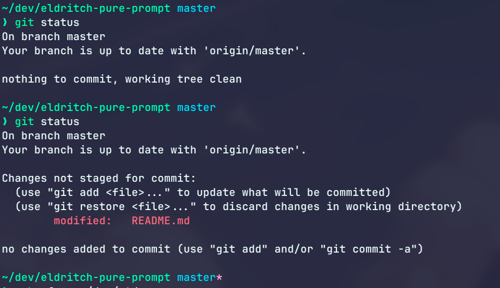

<p align="center">

</p>
<p>
Eldritch is a community-driven dark theme inspired by Lovecraftian horror. With tones from the dark abyss and an emphasis on green and blue, it caters to those who appreciate the darker side of life.
</p>

### Showcase
<br/>

### Installation
1. Add the following to your `~/.zshrc`:
```
zstyle :prompt:pure:git:arrow color "#f16c75"
zstyle :prompt:pure:git:branch color "#04d1f9"
zstyle :prompt:pure:path color "#37f499"
zstyle :prompt:pure:prompt:error color "#f16c75"
zstyle :prompt:pure:prompt:success color "#37f499"
zstyle :prompt:pure:prompt:continuation color "#f7c67f"
zstyle :prompt:pure:suspended_jobs color "#f16c75"
zstyle :prompt:pure:user color "#a48cf2"
zstyle :prompt:pure:user:root color "#f1fc79"
```
